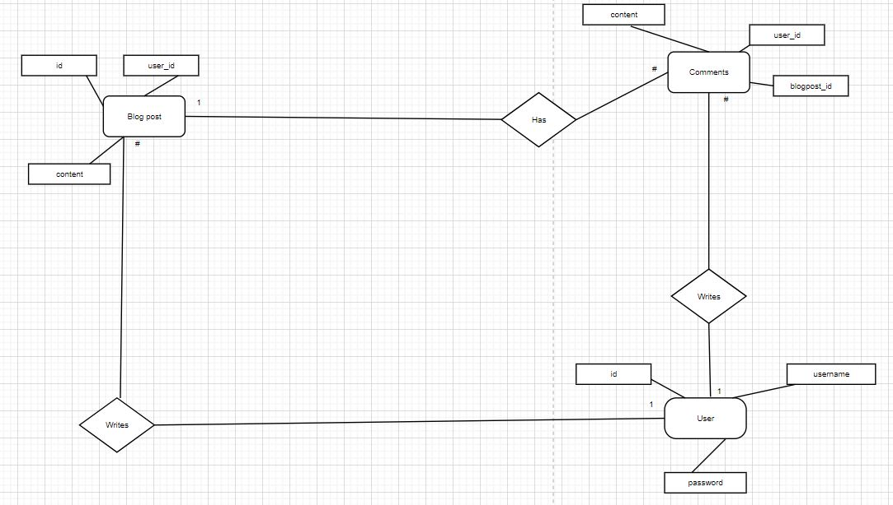

# Projektplan

## 1. Projektbeskrivning (Beskriv vad sidan ska kunna göra)
    Jag ska göra ett forum likt Facebook. Sidan ska ha inlognings function, 
    möjlighet att posta inlägg, ta bort sina egna inlägg och kanske interagera med andra
    användares inlägg.
    Det bör finnas en "admin" roll som kan lägga upp inlägg och även ta bort båda sina egna
    och andras inlägg.

## 2. Vyer (visa bildskisser på dina sidor)
    
    

    Gå till misc för flödesschema (Hänvisning till bild verkar ej fungera)

## 3. Databas med ER-diagram (Bild)
    Får inte bilder att fungera men det finns bild på databasen i misc

## 4. Arkitektur (Beskriv filer och mappar - vad gör/inehåller de?)

